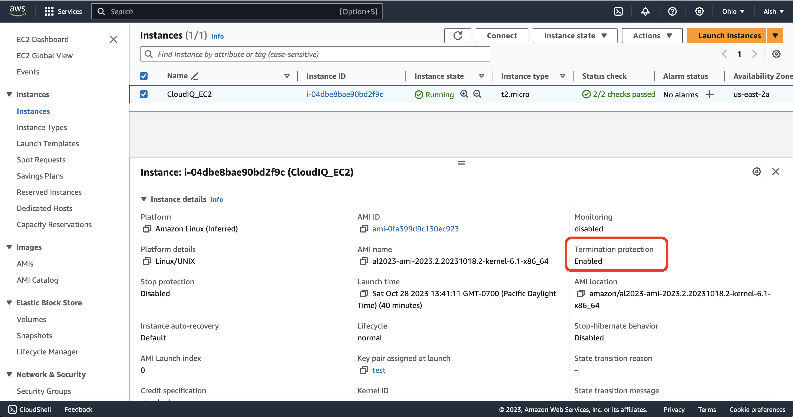

# CloudIQ_Assessment_2_AishwaryaBhavsar
2. Write terraform code to update an EC2 Storage block and update termination rule in AWS

<h1>Project Structure</h1> 
 

<h1>Elastic Block Storage</h1> 

**1. Create EBS Volume:**  
 
**2. Create Running EC2 Instance:**  
 
**3. Attach EBS to EC2:**  
 
**4. Apply termination protection:**  
 

<h1>Terraform Workflow Steps</h1> 

**Step 1: _terraform init_:** 
* Initializes terraform environment and plugins 
* A hidden folder called _.terraform_ will be generated, it contains all the plugins for your platform 

**Step 2: _terraform validate_:**
* To reformat your code and run some basic validations. 

**Step 3: _terraform plan_:**
* The terraform plan command creates an execution plan, which lets you preview the changes that Terraform plans to make to your infrastructure. 

**Step 4: _terraform apply_** 
* Deploy resources to your AWS console.
 

**Step 5: _terraform destroy_**
* This will destroy all the resources/objects created in the AWS console and will help tear down the environment.

